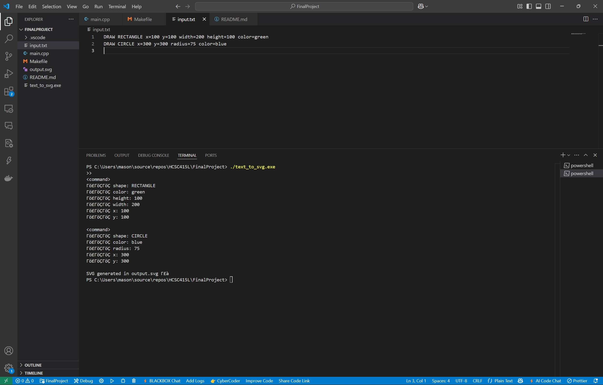

# Text-to-SVG Parser Project (Final – Programming Languages)

This project is a simple **Text-to-Code** system written in C++ that uses a mini domain-specific language (DSL) to convert plain text drawing commands into valid SVG markup. It parses input like `"DRAW RECTANGLE..."` and generates shape definitions that can be rendered directly in any modern web browser.

---

---

## What's Included in This Version

This final version includes a working parser that:

- Accepts a clean text-based DSL input to draw basic 2D shapes
- Parses that input using a recursive descent parser
- Generates valid SVG markup based on the parameters provided
- Displays output using a browser-rendered `.svg` file
- Prints a parse tree structure to the console for debugging

---

---

## **Features**

✔️ Reads a custom drawing command language from `input.txt`  
✔️ Supports drawing:

- **Rectangles** with specified position, dimensions, and color
- **Circles** with position, radius, and color  
  ✔️ Outputs valid SVG in `output.svg`  
  ✔️ Displays the final drawing using a web browser  
  ✔️ Prints a **parse tree** of the drawing command to the terminal  
  ✔️ Fully cross-platform using only C++ and standard libraries

---

---

## **Files Overview**

- **`main.cpp`** – Contains the tokenizer, parser, and SVG generator logic
- **`input.txt`** – Stores drawing commands in the DSL format
- **`output.svg`** – Generated file that displays shapes in a browser
- **`README.md`** – Full overview of the project and how to run it
- **`Makefile`** – (Optional) Compile & run helper for Unix/Linux environments

---

---

## **How It Works**

### **DSL Example Input (`input.txt`)**

DRAW RECTANGLE x=100 y=100 width=200 height=100 color=red DRAW CIRCLE x=300 y=300 radius=75 color=blue

### **Resulting SVG Output (`output.svg`)**

````xml
<rect x="100" y="100" width="200" height="100" fill="red" />
<circle cx="300" cy="300" r="75" fill="blue" />

### **Parse Tree Printed to Console**
<command>
├── shape: RECTANGLE
├── x: 100
├── y: 100
├── width: 200
├── height: 100
└── color: red

---

---

## **Grammar Definiton (BNF)**
<program> ::= <command_list>
<command_list> ::= <command> | <command> <command_list>
<command> ::= "DRAW" <shape> <params>
<shape> ::= "RECTANGLE" | "CIRCLE"
<params> ::= <param> | <param> <params>
<param> ::= <identifier> "=" <value>
<identifier> ::= "x" | "y" | "width" | "height" | "radius" | "color"
<value> ::= <number> | <color_name>
<number> ::= <digit> | <digit> <number>
<digit> ::= "0" | "1" | "2" | "3" | "4" | "5" | "6" | "7" | "8" | "9"
<color_name> ::= "red" | "blue" | "green" | "yellow" | "black" | "white"

---

---

## **Installation & Setup**

1. **Compile the Program**:

   ```sh
   g++ main.cpp -o text_to_svg.exe
````

2. **Run the Executable**:

   ```bash
   ./text_to_svg.exe
   ```

3. **View the Drawing**:

   - Open `output.svg` in any browser or on the left dropdown to see the rendered shapes.

---

---

## **Assumptions & Design Decisions**:

- Input is assumed to be well-formed (no syntax validation included).
- All shapes require explicit parameter declarations.
- Colors are limited to a predefined set of names for simplicity.
- Parameter order does not affect rendering but all required keys must be present.
- Only RECTANGLES and CIRCLES are supported in this version.

---

---

## **Application Screenshots**:

### Screenshot 1: DSL Input, Command Execution, and Parse Tree Output

  
This screenshot shows:

- The custom DSL drawing commands inside `input.txt`
- The terminal running `./text_to_svg.exe`
- The parse tree output in the terminal for both the rectangle and circle

---

### Screenshot 2: SVG Output in VS Code

  
This screenshot displays:

- The rendered `output.svg` inside VS Code
- Confirmation of the SVG generation in the terminal
- Folder structure with key project files visible

---

### Screenshot 3: SVG Output in Browser

  
This shows the final SVG output rendered in a web browser, including:

- A green rectangle
- A blue circle
- This visually confirms the DSL was parsed and translated correctly into SVG markup.

---

---

---

## Author

\** Mason Brown
Morehouse College - Computer Science
*Spring 2025 - Programming Languages Final Proeject\*
